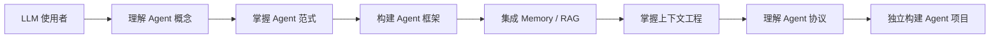

# Hello-Agents 学习地图

> 原始资料路径：`00_Source/hello-agents/`（只读，勿修改）

## 教程概述

Hello-Agents《从零开始构建智能体》是 Datawhale 社区的智能体系统性教程，从 LLM 使用者到 Agent 系统构建者的进阶路径。

## 能力成长路径



## 章节文件路径索引

### 前言
| 文件 | 路径 |
|------|------|
| 文档 | `00_Source/hello-agents/docs/前言.md` |
| 英文版 | `00_Source/hello-agents/docs/README_EN.md` |
| 侧边栏 | `00_Source/hello-agents/docs/_sidebar.md` |

### Part 1：智能体与语言模型基础（Ch01–Ch03）

| 章节                     | 文档路径                                                  | 代码路径                                    |
| ---------------------- | ----------------------------------------------------- | --------------------------------------- |
| **Ch01 初识智能体**         | `00_Source/hello-agents/docs/chapter1/第一章 初识智能体.md`   | `00_Source/hello-agents/code/chapter1/` |
| **Ch02 智能体发展史** 🔵可后读  | `00_Source/hello-agents/docs/chapter2/第二章 智能体发展史.md`  | `00_Source/hello-agents/code/chapter2/` |
| **Ch03 大语言模型基础** 🟡次重点 | `00_Source/hello-agents/docs/chapter3/第三章 大语言模型基础.md` | `00_Source/hello-agents/code/chapter3/` |

### Part 2：构建你的大语言模型智能体（Ch04–Ch07）

| 章节 | 文档路径 | 代码路径 |
|------|---------|---------|
| **Ch04 智能体经典范式构建** 🔴必读 | `00_Source/hello-agents/docs/chapter4/第四章 智能体经典范式构建.md` | `00_Source/hello-agents/code/chapter4/` |
| **Ch05 低代码平台** 🔵可后读 | `00_Source/hello-agents/docs/chapter5/第五章 基于低代码平台的智能体搭建.md` | `00_Source/hello-agents/code/chapter5/` |
| **Ch06 框架开发实践** 🟡次重点 | `00_Source/hello-agents/docs/chapter6/第六章 框架开发实践.md` | `00_Source/hello-agents/code/chapter6/` |
| **Ch07 构建你的Agent框架** 🔴必读 | `00_Source/hello-agents/docs/chapter7/第七章 构建你的Agent框架.md` | `00_Source/hello-agents/code/chapter7/` |

### Part 3：高级知识扩展（Ch08–Ch12）

| 章节 | 文档路径 | 代码路径 |
|------|---------|---------|
| **Ch08 记忆与检索** 🔴必读 | `00_Source/hello-agents/docs/chapter8/第八章 记忆与检索.md` | `00_Source/hello-agents/code/chapter8/` |
| **Ch09 上下文工程** 🔴必读 | `00_Source/hello-agents/docs/chapter9/第九章 上下文工程.md` | `00_Source/hello-agents/code/chapter9/` |
| **Ch10 智能体通信协议** 🔴必读 | `00_Source/hello-agents/docs/chapter10/第十章 智能体通信协议.md` | `00_Source/hello-agents/code/chapter10/` |
| **Ch11 Agentic-RL** 🟡次重点 | `00_Source/hello-agents/docs/chapter11/第十一章 Agentic-RL.md` | `00_Source/hello-agents/code/chapter11/` |
| **Ch12 智能体评估** 🟡次重点 | `00_Source/hello-agents/docs/chapter12/第十二章 智能体性能评估.md` | `00_Source/hello-agents/code/chapter12/` |

### Part 4：综合案例进阶（Ch13–Ch15）

| 章节 | 文档路径 | 代码路径 |
|------|---------|---------|
| **Ch13 智能旅行助手** 🔴必读 | `00_Source/hello-agents/docs/chapter13/第十三章 智能旅行助手.md` | `00_Source/hello-agents/code/chapter13/` |
| **Ch14 自动化深度研究智能体** 🔴必读 | `00_Source/hello-agents/docs/chapter14/第十四章 自动化深度研究智能体.md` | `00_Source/hello-agents/code/chapter14/` |
| **Ch15 构建赛博小镇** 🔵可后读 | `00_Source/hello-agents/docs/chapter15/第十五章 构建赛博小镇.md` | `00_Source/hello-agents/code/chapter15/` |

### Part 5：毕业设计（Ch16）

| 章节 | 文档路径 | 代码路径 |
|------|---------|---------|
| **Ch16 毕业设计** 🔴必读 | `00_Source/hello-agents/docs/chapter16/第十六章 毕业设计.md` | `00_Source/hello-agents/code/chapter16/` |

### 附加资料

| 资料 | 路径 |
|------|------|
| Additional-Chapter（N8N 安装指南等） | `00_Source/hello-agents/Additional-Chapter/` |
| Extra-Chapter（面试题、补充知识等） | `00_Source/hello-agents/Extra-Chapter/` |
| Co-creation-projects（社区共创毕业设计） | `00_Source/hello-agents/Co-creation-projects/` |
| 主 README | `00_Source/hello-agents/README.md` |

## 学习优先级标记说明

- 🔴 **必读主线** — 核心学习路径，必须产出一篇章节笔记 + 卡片 + 实验
- 🟡 **次重点** — 需要了解但可以适当压缩
- 🔵 **可后读** — 有时间再补充，不影响主线理解

## 推荐学习顺序

```
Ch01 → Ch04 → Ch07 → Ch08 → Ch09 → Ch10 → Ch13/Ch14 → Ch16
```
中间穿插 Ch03（补 LLM 基础）、Ch06（框架对比）、Ch12（评估）

## 当前进度

参见 [[99_System/学习进度]]

## 学习建议

- 不要机械从头读到尾
- 先抓 Agent 构建主线
- 每章至少产出一篇章节笔记 + 1-3 张卡片
- 代码章节必须创建实验记录
- 每 3 章做一次阶段复盘
