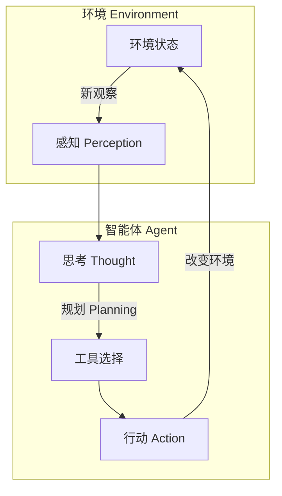
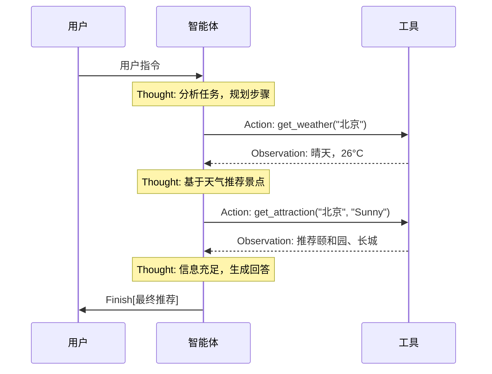

# Ch01 初识智能体

> 参考资料：`00_Source/hello-agents/docs/chapter1/第一章 初识智能体.md`
> 配套代码：`00_Source/hello-agents/code/chapter1/`

## 1. 本章解决什么问题？

1. **智能体是什么？** — 从传统 AI 到 LLM 驱动的 Agent，建立对"智能体"的完整认知。
2. **智能体如何工作？** — 理解"感知 → 思考 → 行动"的核心循环，以及 PEAS 任务环境定义。
3. **如何动手构建一个智能体？** — 通过一个 5 分钟的旅行助手代码，体验 Thought-Action-Observation 循环。

## 2. 本章核心结论

- 智能体的本质是 **"感知环境 → 自主决策 → 采取行动 → 达成目标"** 的闭环系统
- LLM 智能体的核心差异在于：用预训练的"大脑"替代了人工编写的规则，使 Agent 能理解模糊指令、动态规划、自主使用工具
- Agent vs Workflow：Workflow 是写死的流程图，Agent 是目标驱动的自主系统

## 3. 核心概念

- [[Agent]]：智能体的基本定义和四要素（环境、感知、行动、自主性）
- [[PEAS]]：描述智能体任务环境的框架（Performance, Environment, Actuators, Sensors）
- [[Thought-Action-Observation]]：LLM 智能体的核心交互范式
- [[Environment]]：智能体所处的外部世界及其特性（部分可观察、随机性、动态性等）
- [[Tool Calling]]：智能体调用外部工具获取信息或影响环境的能力
- [[Neural-Symbolic AI]]：连接主义与符号主义的融合范式

### 传统智能体分类（了解即可）

| 类型 | 核心机制 | 例子 |
|------|---------|------|
| 简单反射 | 条件-动作规则 | 恒温器 |
| 基于模型 | 内部世界模型 + 记忆 | 自动驾驶 |
| 基于目标 | 规划 (Planning) | GPS 导航 |
| 基于效用 | 最大化期望效用 | 多目标决策 |
| 学习型 | 强化学习 | AlphaGo |

## 4. 核心流程

### Agent 循环（Agent Loop）

### Thought-Action-Observation 交互

## 5. 关键代码 / 工具 / 框架

- **相关文件**：`00_Source/hello-agents/code/chapter1/FirstAgentTest.py`
- **核心组件**：
  - `OpenAICompatibleClient` — 通用 LLM 调用封装
  - `get_weather()` — wttr.in 天气 API 工具
  - `get_attraction()` — Tavily 搜索工具
  - 主循环 — 解析 `Thought/Action` → 执行工具 → 注入 `Observation`
- **依赖**：`pip install requests tavily-python openai`

## 6. 我学会了什么能力？

学完这一章后，我应该能够：

- [x] 用一句话向别人解释"什么是智能体"
- [x] 画出智能体的"感知-思考-行动"循环图
- [x] 用 PEAS 模型分析任意一个 Agent 应用的任务环境
- [x] 区分传统智能体（规则驱动）和 LLM 智能体（推理驱动）
- [x] 说出 Workflow 和 Agent 的核心差异
- [x] 理解 Agent 作为"工具"和作为"协作者"两种模式的区别

**需要动手验证**：
- [ ] 配置 API KEY，实际运行 1.3 节的旅行助手代码
- [ ] 修改代码添加一个新工具（如查询航班）

## 7. 我的理解

**智能体不是什么神秘的东西。** 它的核心模式就是"看情况 → 想一下 → 做点啥 → 再看情况"的循环。

传统智能体和 LLM 智能体的本质区别在于"想一下"这一环节：传统智能体是用 if-else 规则来"想"，LLM 智能体是用大模型来"想"。LLM 的好处是能理解模糊的、自然语言的指令，还能自己规划步骤；坏处是模型可能会"幻觉"，而且每次调用都有延迟和成本。

**Agent vs Workflow 的区分特别重要**：Workflow 是精确的铁路轨道，Agent 是有目的地的自动驾驶汽车。前者适合稳定、可预测的场景（审批流程），后者适合开放、多变的场景（旅行规划、研究分析）。

## 8. 还没懂的问题

- [ ] 在实践中，Agent 的 "Thought" 是真正在"推理"，还是在按照训练数据的模式"模仿推理"？
- [ ] 1.3 节旅行助手需要 API KEY 才能运行，如果用本地模型（如 Ollama）替代，效果差异有多大？
- [ ] 如果 Agent 陷入无限循环（反复调用工具却不结束），有哪些检测和恢复策略？

## 9. 相关笔记

- 概念：[[Agent]]、[[PEAS]]、[[Thought-Action-Observation]]、[[Environment]]、[[Tool Calling]]
- 范式：需要学习 Ch04 后再补充（ReAct 范式与此处的 TAO 循环密切相关）
- 架构：暂无（Ch07 后再补充 HelloAgents 框架）
- 实验：[[Ch01_旅行助手实验记录]]
