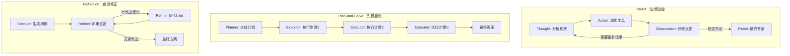

# Ch04 智能体经典范式构建

> 参考资料：`00_Source/hello-agents/docs/chapter4/第四章 智能体经典范式构建.md`
> 配套代码：`00_Source/hello-agents/code/chapter4/`（llm_client.py, tools.py, ReAct.py, Plan_and_solve.py, Reflection.py）

## 1. 本章解决什么问题？

1. **如何让 LLM 不只是聊天？** — 三种经典范式让 LLM 能调用工具、规划步骤、自我修正
2. **为什么要"重复造轮子"？** — 亲手实现才能理解框架背后的设计机制，暴露工程挑战
3. **不同范式怎么选？** — ReAct 适合探索性任务，Plan-and-Solve 适合结构化推理，Reflection 适合高质量输出

## 2. 本章核心结论

- **ReAct**：边想边做，Thought-Action-Observation 循环，适合需要外部知识的任务
- **Plan-and-Solve**：先谋后动，Plan → Execute 两阶段，适合多步逻辑推理
- **Reflection**：自我批判，Execute → Reflect → Refine 迭代，适合高质量输出场景

| 范式             | 风格   | 核心机制         | 适合场景           |
| -------------- | ---- | ------------ | -------------- |
| ReAct          | 侦探式  | 思考-行动-观察循环   | 查天气、搜网页、调用 API |
| Plan-and-Solve | 建筑师式 | 先规划蓝图，再按步骤施工 | 数学题、报告撰写、代码生成  |
| Reflection     | 审稿人式 | 初稿 → 评审 → 修改 | 代码优化、论文润色、决策支持 |

## 3. 核心概念

- [[ReAct]]：Reasoning + Acting，思考-行动-观察循环
- [[Plan-and-Solve]]：规划与执行分离的两阶段范式
- [[Reflection]]：执行-反思-优化的自我迭代机制
- [[ToolExecutor]]：工具注册与执行管理器（架构组件）
- [[Memory (Reflection)]]：短期记忆模块，存储执行与反思轨迹
- [[Prompt Engineering]]：提示词设计是驱动 LLM 行为的核心

## 4. 核心流程

### 三种范式的对比

## 5. 关键代码 / 工具 / 框架

- **相关文件**：
  - `llm_client.py` — `HelloAgentsLLM` 类，封装 LLM 调用
  - `tools.py` — `ToolExecutor` 工具管理器 + `search()` SerpApi 搜索工具
  - `ReAct.py` — `ReActAgent` 类，Thought-Action-Observation 循环
  - `Plan_and_solve.py` — `Planner` + `Executor` + `PlanAndSolveAgent`
  - `Reflection.py` — `Memory` + `ReflectionAgent`
- **核心架构**：
  - 提示词模板是驱动范式的核心（`REACT_PROMPT_TEMPLATE`, `PLANNER_PROMPT_TEMPLATE` 等）
  - 正则表达式解析 LLM 输出（提取 Thought/Action）
  - `ToolExecutor.registerTool(name, description, func)` 注册工具
- **依赖**：`pip install openai python-dotenv google-search-results`

## 6. 我学会了什么能力？

学完这一章后，我应该能够：

- [ ] 从零实现一个 ReAct Agent（包括 Prompt、工具注册、输出解析、循环控制）
- [ ] 实现 Plan-and-Solve 两阶段架构（Planner + Executor）
- [ ] 实现 Reflection 迭代优化机制（Memory + Reflect + Refine）
- [ ] 根据任务特点选择合适的 Agent 范式
- [ ] 调试 ReAct 的输出解析问题（正则匹配、格式遵循）
- [ ] 设计好的提示词模板（角色设定、格式约束、Few-shot）

## 7. 我的理解

这一章的核心洞察是：**范式就是"思考方式"的不同**。

- ReAct 是"走一步看一步"：每次调用 LLM 后立刻行动，根据行动结果决定下一步。优点是灵活，能纠错；缺点是可能陷入局部最优。
- Plan-and-Solve 是"先画蓝图再施工"：一次性规划好所有步骤，然后逐一执行。优点是结构清晰、目标一致；缺点是计划是静态的，无法根据中间结果调整。
- Reflection 是"自我批判"：初稿 → 评审 → 修改 → 再评审。优点是质量高；缺点是成本高（每轮至少 2 次 LLM 调用）。

**为什么造轮子？** 直接学 LangChain 不行吗？—— 因为框架隐藏了太多细节。比如 ReAct 的正则解析、提示词的脆弱性、防止死循环的 max_steps，这些都是亲手实现才能体会的工程挑战。

## 8. 还没懂的问题

- [ ] 正则表达式解析 LLM 输出在什么情况下会失败？有没有更鲁棒的解析方案？
- [ ] Plan-and-Solve 的计划是静态的，如果中间步骤失败怎么办？动态重规划怎么设计？
- [ ] 三种范式可以组合吗？比如 ReAct + Reflection？
- [ ] 工具数量增加到 50+ 时，工具描述方式还能有效工作吗？

## 9. 相关笔记

- 概念：[[ReAct]]、[[Plan-and-Solve]]、[[Reflection]]
- 架构：[[ToolExecutor]]、[[Memory (Reflection)]]
- 实验：[[Ch04_ReAct实验记录]]
- 前置章节：[[Ch01_初识智能体]]（TAO 循环是 ReAct 的前身）
