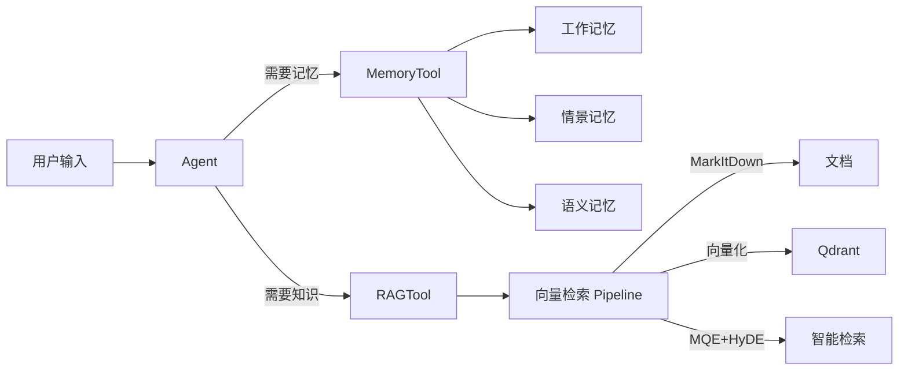
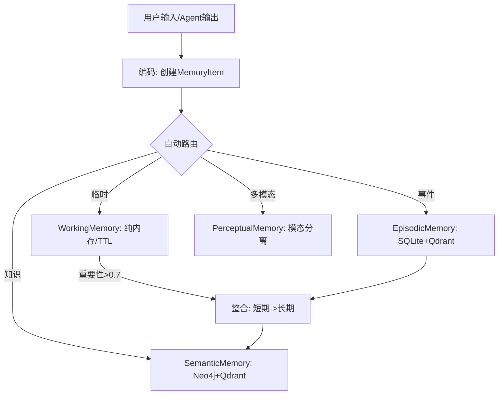
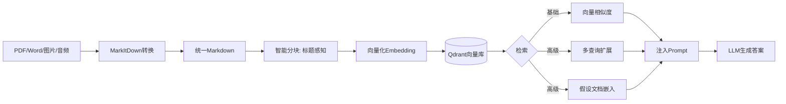

# Ch08 记忆与检索

> 参考资料：`00_Source/hello-agents/docs/chapter8/第八章 记忆与检索.md`
> 配套代码：`00_Source/hello-agents/code/chapter8/`（共 11 个 Python 文件）

## 1. 本章解决什么问题？

1. **LLM 无状态导致对话遗忘** — 每次调用都是独立计算，无法记住历史 → 引入记忆系统
2. **LLM 知识有局限** — 训练数据有截止时间，缺少专业领域知识 → 引入 RAG 检索增强
3. **如何让 Agent 形成知识体系** — 不只是"记住"，还要分类、整合、遗忘 → 四层记忆架构

## 2. 本章核心结论

- **记忆系统 = 四个类型 + 统一接口**：WorkingMemory（临时）→ EpisodicMemory（事件）→ SemanticMemory（知识）→ PerceptualMemory（多模态）
- **RAG = 检索 + 增强 + 生成**：先搜外部知识库，再把结果注入 Prompt，最后让 LLM 生成
- **设计原则**：Memory 和 RAG 都封装为 Tool，Agent 只需 `tool_registry` 即可获得这两种能力

## 3. 核心概念

- [[Memory]]：让 Agent 记住对话历史、用户偏好、学习经历的系统
- [[RAG]]：检索增强生成——从外部知识库检索后注入 LLM 上下文
- [[Working Memory]]：临时会话记忆，TTL 自动过期，纯内存存储
- [[Episodic Memory]]：事件记忆，时间序列，SQLite+Qdrant 混合存储
- [[Semantic Memory]]：抽象知识，Neo4j 图 + Qdrant 向量混合检索
- [[Embedding]]：文本转向量，让计算机理解语义相似度
- [[Vector Store]]：向量数据库（Qdrant），高效存储和检索向量

## 4. 核心流程

### 记忆系统工作流程

### RAG 工作流程

## 5. 关键代码 / 工具 / 框架

- **依赖**：`pip install "hello-agents[all]==0.2.0"`
- **外部服务**：Qdrant（向量库）、Neo4j（图库）、百炼（Embedding API）
- **代码文件**：
  - `01-03` → MemoryTool 基础操作、架构、工作记忆
  - `04-05` → RAGTool MarkItDown、高级检索
  - `06-08` → 记忆整合、智能问答、Agent 集成
  - `09-10` → 四种记忆类型深潜、RAG 完整管道
  - `11` → 完整 Web 应用（PDF 学习助手 + Gradio）

## 6. 我学会了什么能力？

- [ ] 解释人类记忆模型如何启发 Agent 记忆设计
- [ ] 理解四种记忆类型的区别和适用场景
- [ ] 理解 RAG 的基本流程：文档处理 → 分块 → 向量化 → 检索 → 生成
- [ ] 了解 MQE（多查询扩展）和 HyDE（假设文档嵌入）的检索策略
- [ ] 理解 Memory 和 RAG 如何封装为 Tool 集成到 Agent

**需要动手验证**：
- [ ] 安装 hello-agents 0.2.0，配置 Qdrant 和 Neo4j
- [ ] 运行记忆系统基本操作示例

## 7. 我的理解

这一章的本质是把两个 LLM 的核心短板"补上"了：

**Memory 解决"失忆症"**：LLM 本身无状态，每次调用都是全新开始。Memory 系统让 Agent 能记住之前聊过什么、用户偏好什么、经历过什么。关键设计是四种记忆类型的分类——不是所有记忆都该同样处理，临时对话放工作记忆、重要事件放情景记忆、抽象知识放语义记忆。

**RAG 解决"知识盲区"**：LLM 的知识截止于训练日期。RAG 在 LLM "发言"之前先帮它查资料。核心链路是：文档 → Markdown → 分块 → 向量化 → 存入向量库 → 检索 → 注入 Prompt → 生成。高级策略（MQE/HyDE）则是优化"检索"这一步的准确度。

这两个系统都封装为 Tool 而不是新的 Agent 类，体现了 Ch07 的"万物皆为工具"理念——Agent 不需要知道 Memory 和 RAG 的内部实现，它只知道"我有 memory 工具和 RAG 工具"。

## 8. 还没懂的问题

- [ ] 向量检索和图检索在什么场景下各自优势明显？
- [ ] Embedding 模型的选择对 RAG 效果影响有多大？
- [ ] 大规模的 Memory 存储（百万级记忆），检索效率如何保证？

## 9. 相关笔记

- 概念：[[Memory]]、[[RAG]]、[[Embedding]]、[[Vector Store]]
- 架构：[[MemoryTool]]、[[RAGTool]]
- 前置章节：[[Ch07_Agent框架]]（ToolRegistry 设计）
- 后续章节：[[Ch09_上下文工程]]
