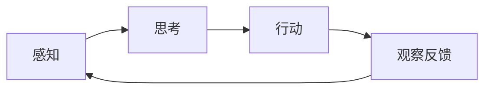

# Agent（智能体）

## 一句话解释

智能体是能够**感知环境 → 自主决策 → 采取行动 → 达成目标**的实体，相当于一个拥有"大脑"的自动化系统。

## 它解决什么问题？

解决"如何让一个系统在不确定、变化的环境中，自主地完成复杂任务"的问题。传统的程序只能执行写死的指令，遇到预设之外的情况就失效；Agent 能根据实际情况灵活调整。

## 为什么重要？

Agent 是 AI 从"工具"走向"协作者"的关键范式。如果说 LLM 是大脑，Agent 就是给这个大脑装上了眼睛（感知）、手脚（工具）、记忆（Memory），让它能真正在现实世界中做事。

## 关键组成

- **环境 (Environment)**：智能体所处的外部世界
- **感知 (Perception)**：通过传感器/API 获取环境信息
- **思考 (Thought)**：基于 LLM 的推理和规划
- **行动 (Action)**：通过执行器/工具影响环境
- **自主性 (Autonomy)**：独立决策，不依赖外部指令

## Agent 的核心循环

## 使用场景

- **旅行规划**：接收模糊指令 → 查天气 → 查景点 → 生成行程
- **代码开发**：理解需求 → 搜索代码库 → 编写代码 → 调试
- **客服系统**：理解问题 → 查询订单 → 分析原因 → 提供方案
- **研究分析**：提出问题 → 搜索资料 → 分析总结 → 生成报告

## 容易误解的点

- **Agent ≠ Chatbot**：Chatbot 只是对话，Agent 能采取行动改变外部世界
- **Agent ≠ Workflow**：Workflow 是固定的流程图，Agent 是自主决策的系统（见 1.4.3）
- **Agent 不一定要有物理形态**：数字环境中调用 API 也是"行动"

## 和其他概念的关系

- [[LLM]]：Agent 的"大脑"，提供推理和决策能力
- [[Tool Calling]]：Agent "行动"的具体实现方式
- [[Environment]]：Agent 所处的外部世界
- [[Memory]]：让 Agent 记住历史信息的机制
- [[ReAct]]：Agent 思考-行动循环的经典范式实现

## 我的例子

我想做一个"日报生成助手"：它每天早上读取我的 Git 提交记录（感知），分析哪些是重要变更（思考），自动生成日报草稿（行动），我确认后发送（反馈）。这就是一个典型的 Agent 应用。

## 来源章节

- [[Ch01_初识智能体]]
