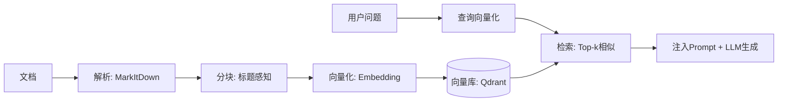

# RAG（检索增强生成）

## 一句话解释

RAG = 在 LLM 生成回答之前，先从外部知识库**检索**相关信息，作为**增强**上下文注入 Prompt，再驱动 LLM **生成**更准确的回答。

## 它解决什么问题？

LLM 的知识全部来自训练数据，有三个先天缺陷：
1. **时效性差**：训练截止日期之后的不知道
2. **专业领域弱**：通用模型在垂直领域知识不足
3. **容易幻觉**：没有事实依据时可能胡编

RAG 通过在回答前先"查资料"，把查到的事实注入 LLM，显著减少幻觉。

## 基本流程

## 三代演进

| 阶段 | 检索方式 | 特点 |
|------|---------|------|
| **Naive RAG** | TF-IDF / BM25 关键词匹配 | 只能匹配字面，不理解语义 |
| **Advanced RAG** | 稠密向量语义检索 | 理解语义相似度，引入重排序 |
| **Modular RAG** | 混合检索 + MQE + HyDE | 模块化、可组合、智能化 |

## 三种高级检索策略

| 策略 | 原理 | 适用场景 |
|------|------|---------|
| **基础检索** | 用问题向量直接搜 | 简单查询 |
| **MQE** | LLM 把一个问题扩展成多种问法 | 用词差异大时的召回 |
| **HyDE** | 先让 LLM 写一段"假设答案"，用答案去搜 | 专业领域，缩小语义鸿沟 |

## 关键设计

- **MarkItDown**：把所有格式（PDF/Word/图片/音频）统一转 Markdown
- **标题感知分块**：按 `#/##/###` 结构分割，保持语义完整
- **中英混合 Token 估算**：CJK 字符 ≈ 1 token，其他按空白分词
- **命名空间隔离**：不同用户/项目用不同 `rag_namespace`

## 容易误解的点

- **RAG 不是"搜完直接贴"**：检索结果需要经过分块、排序、去重、合并，再注入 Prompt
- **RAG 的效果依赖 Embedding 质量**：换一个 Embedding 模型可能效果天差地别

## 和其他概念的关系

- [[Memory]]：RAG 查外部知识，Memory 记交互历史
- [[Embedding]]：RAG 的核心技术，文本→向量
- [[Vector Store]]：RAG 的底层存储和检索引擎

## 来源章节

- [[Ch08_记忆与检索]]
