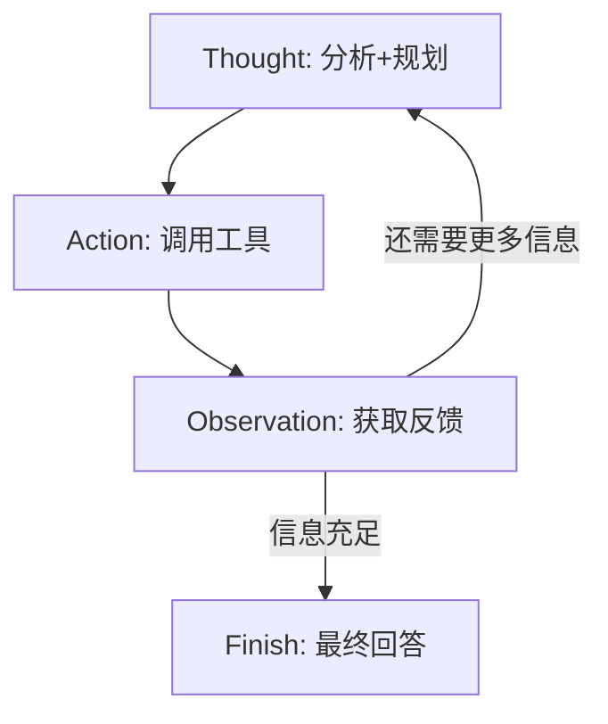

# Thought-Action-Observation（TAO 循环）

## 一句话解释

TAO 是 LLM 智能体的核心交互范式：智能体先**思考**（Thought）当前状况和下一步计划，再**行动**（Action）调用工具或做出响应，然后接收**观察**（Observation）结果反馈，形成持续循环。

## 它解决什么问题？

解决"LLM 如何与外部世界交互"的问题。LLM 本身只是一个文本生成模型，无法直接调用 API、查询数据库或影响外部系统。TAO 范式通过结构化的输出格式，让 LLM 的推理能力与外部工具的执行能力结合起来。

## 为什么重要？

TAO 是所有现代 Agent 框架（ReAct、LangChain、AutoGen 等）的底层模式。理解了 TAO，就理解了 Agent 如何"思考"和"做事"的基本单元。

## 三要素

| 要素              | 含义                    | 示例                       |
| --------------- | --------------------- | ------------------------ |
| **Thought**     | 内部推理过程：分析现状、规划步骤、反思结果 | "用户想知道北京的天气，我需要调用天气查询工具" |
| **Action**      | 对外部世界的具体操作：工具调用或最终回答  | `get_weather(city="北京")` |
| **Observation** | 行动后的环境反馈              | "北京当前天气:晴，气温26摄氏度"       |

## 基本循环



## 使用场景

- **所有需要多步推理的 Agent 任务**：旅行规划、代码生成、研究分析
- **需要与外部工具交互的任务**：查天气、搜网页、操作数据库
- **需要上下文积累的任务**：多轮对话、逐步解决问题

## 容易误解的点

- **Thought 不一定代表真正的"意识"**：它只是模型根据训练数据生成的推理文本，可能看起来像在思考，本质上是模式匹配
- **Action 不限于调用工具**：也可以是 `Finish[答案]` 表示结束任务
- **TAO 循环可能陷入死循环**：需要设置最大循环次数作为安全措施

## 和其他概念的关系

- [[Agent]]：TAO 是 Agent 执行循环的具体实现方式
- [[ReAct]]：TAO 与 ReAct 范式本质上相同，都是 Thought-Action-Observation 循环
- [[Tool Calling]]：Action 阶段的具体实现机制
- [[Environment]]：Observation 的来源，行动作用的对象

## 我的例子

当我说"帮我查一下明天上海到北京的高铁"时，Agent 的 TAO 循环：
```
Thought: 用户需要查询高铁信息，我需要调用查询工具，参数是明天、上海、北京
Action: search_train(from="上海", to="北京", date="2026-05-10")
Observation: G2次 07:00-11:36, G6次 09:00-13:18...
Thought: 查到多趟高铁，需要整理给用户
Action: Finish[为您查到以下高铁...]
```

## 来源章节

- [[Ch01_初识智能体]]
