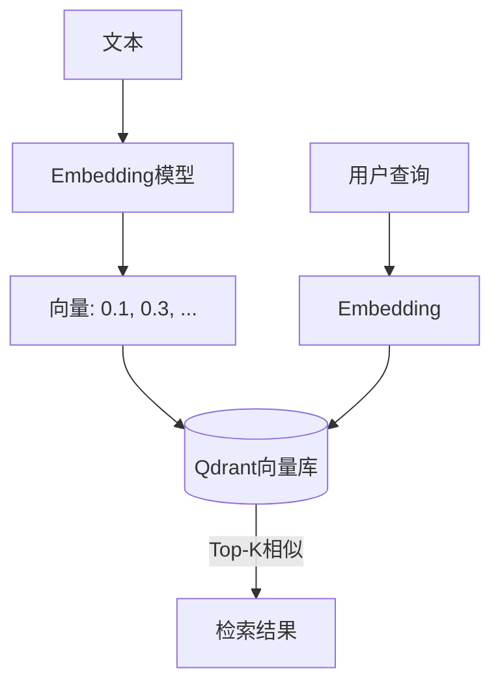

# Vector Store（向量数据库）

## 一句话解释

向量数据库是一种专门存储和检索**高维向量**的数据库，通过计算向量之间的余弦相似度来找到"语义最接近"的内容，是 RAG 和 Memory 系统的核心引擎。

## 它解决什么问题？

传统数据库只能精确匹配（`WHERE name = 'Python'`），无法理解"这段文字和那段文字说的是同一件事"。向量数据库把文本转成高维向量后，可以通过向量间的距离来衡量**语义相似度**——即使用词完全不同，只要意思相近，也能检索到。

## 为什么重要？

RAG 的"检索"环节、Memory 的"搜索"环节，底层都靠向量数据库。没有它，就没法高效地在海量文本中找到和查询最相关的内容。

## 核心概念

| 概念 | 含义 |
|------|------|
| **Embedding** | 把文本/图像/音频映射成固定维度的浮点数向量 |
| **向量维度** | 向量的长度，如 384（MiniLM）、1024（百炼）、1536（OpenAI） |
| **余弦相似度** | 最常用的向量相似度度量，值域 [-1, 1] |
| **Top-K 检索** | 返回相似度最高的 K 个结果 |
| **集合（Collection）** | 向量的逻辑分组，类似数据库中的"表" |

## 在 HelloAgents 中的角色

具体架构中的位置：
- **EpisodicMemory** → SQLite 存结构化数据 + Qdrant 存向量
- **SemanticMemory** → Neo4j 存图谱关系 + Qdrant 存向量
- **RAGTool** → Qdrant 存文档片段的向量

## 使用场景

- **RAG 检索**：用户的自然语言问题 → 向量化 → 在知识库中找相关段落
- **Memory 搜索**："用户之前提到过 Python 吗？" → 向量化 → 搜索所有记忆
- **语义去重**：判断新文章是否和已有内容重复

## 容易误解的点

- **向量数据库不是"AI"**：它只负责存储和检索，不负责"理解"——理解来自 Embedding 模型
- **维度必须一致**：同一个 Collection 中所有向量维度必须相同，不能混用不同维度的 Embedding
- **向量检索不是银弹**：纯向量检索可能漏掉关键词精确匹配的结果，所以常配合关键词检索（BM25）做混合检索

## 和其他概念的关系

- [[Embedding]]：向量数据库的输入来源
- [[RAG]]：RAG 的检索环节依赖向量数据库
- [[Memory]]：语义/情景记忆的底层存储引擎

## 来源章节

- [[Ch08_记忆与检索]]
