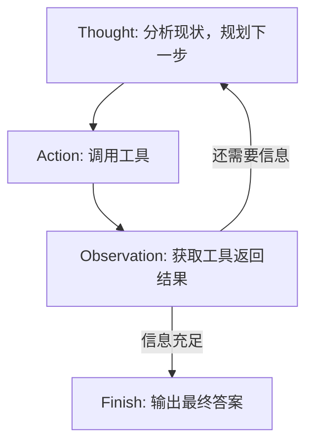

# ReAct（Reasoning + Acting）

## 它解决什么问题？

解决"LLM 如何与外部世界交互并动态调整行动"的问题。传统的 Chain-of-Thought 只能"纯思考"，无法获取实时信息或调用工具；而"纯行动"模式又缺乏推理和纠错能力。ReAct 将两者结合，让智能体边想边做。

由 Shunyu Yao 于 2022 年提出，灵感来自人类解决问题的方式——我们不会闷头想完再做，而是"想一下 → 做一下 → 看看结果 → 再想"。

## 基本循环



形式化表达：在每个时间步 t，LLM π 根据问题 q 和历史轨迹生成思考和行动：

```
(th_t, a_t) = π(q, (a_1,o_1), ..., (a_{t-1},o_{t-1}))
o_t = T(a_t)  // 工具执行后返回观察
```

## 适合场景

- **需要外部知识的任务**：查询实时信息（天气、新闻、股价）
- **需要精确计算的任务**：将计算交给计算器工具
- **需要与 API 交互的任务**：操作数据库、调用服务
- **探索性任务**：不确定需要几步才能完成的任务

## 不适合场景

- 有明确步骤、可一次性规划的任务（用 Plan-and-Solve 更高效）
- 需要高质量输出、反复打磨的任务（用 Reflection 更合适）
- LLM 能力较弱时（指令遵循差 → 格式解析失败 → 循环中断）

## 关键 Prompt / 伪代码

```python
# 提示词模板
REACT_PROMPT_TEMPLATE = """
你是一个有能力调用外部工具的智能助手。
可用工具：{tools}

回应格式：
Thought: 你的思考过程
Action: tool_name[tool_input] 或 Finish[最终答案]

Question: {question}
History: {history}
"""

# 主循环伪代码
while step < max_steps:
    prompt = format_prompt(tools, question, history)
    response = llm.think(prompt)          # 调用 LLM
    thought, action = parse_output(response)  # 解析输出
    
    if action.startswith("Finish"):
        return extract_answer(action)
    
    tool_name, tool_input = parse_action(action)
    observation = tools[tool_name](tool_input)  # 执行工具
    history.append(action, observation)        # 记录观察
```

## 核心组件

| 组件 | 职责 | 关键技术 |
|------|------|---------|
| 提示词模板 | 告诉 LLM 角色、工具、输出格式 | Prompt Engineering |
| 输出解析器 | 从 LLM 文本中提取 Thought/Action | 正则表达式 |
| 工具执行器 | 管理和调度工具函数 | 字典映射 name→func |
| 历史记录 | 存储 Action-Observation 链 | prompt_history 列表 |
| max_steps | 安全阀，防止无限循环 | 计数器 |

## 最小例子

```
Question: 华为最新的手机是什么？

Thought: 我需要搜索最新手机信息
Action: Search[华为最新手机型号]
Observation: [1] 华为 Mate 70...

Thought: 根据搜索结果，最新型号是 Mate 70
Action: Finish[华为最新手机是 Mate 70...]
```

## 调试技巧

1. **打印完整 prompt**：每次调用 LLM 前输出格式化好的完整提示词
2. **分析原始输出**：解析失败时看 LLM 实际返回了什么
3. **检查 tool_input 格式**：确保工具接收的参数格式正确
4. **Few-shot 示例**：在 prompt 中加入成功的 Thought-Action-Observation 样例
5. **调整 temperature=0**：保证输出稳定性

## 我自己的理解

ReAct 的本质是让 LLM 从"静态问答"变成了"动态探索"。以前 LLM 只能基于训练数据回答，现在它能"看情况办事"——查不到就换个关键词，结果不好就再查一次。这种灵活性是它最大的价值。

但它也有代价：每一步都要调 LLM，成本高、速度慢。而且正则解析输出非常脆弱，模型格式稍微不对就挂了。这也是为什么后续会有更成熟的框架来解决这些问题。

## 相关实验

- [[Ch04_ReAct实验记录]]

## 相关概念

- [[Agent]]：ReAct 是 Agent 的经典实现方式
- [[Tool Calling]]：Action 阶段的具体实现
- [[Thought-Action-Observation]]：ReAct 的核心循环就是 TAO 循环

## 来源章节

- [[Ch04_智能体经典范式构建]]
