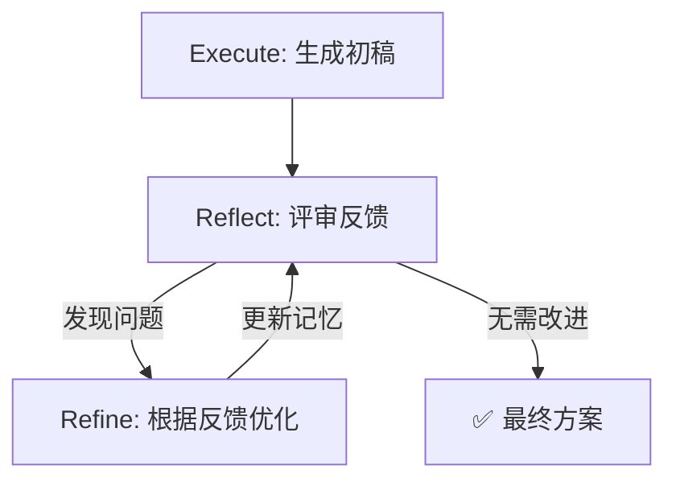

# Reflection（自我反思与迭代）

## 它解决什么问题？

解决"智能体一次性输出质量不够高"的问题。无论是 ReAct 还是 Plan-and-Solve，生成答案后流程就结束了。Reflection 引入了一种"事后自我校正"机制：初稿 → 评审 → 修改 → 再评审，持续迭代直到满意。

灵感来自 Shinn 等人 2023 年提出的 Reflexion 框架。类比人类的学习过程——写完作文会检查，做完题会验算。

## 基本循环



形式化表达：

```
Reflection:  F_i = π_reflect(Task, O_i)          // 评审第i版输出
Refinement:  O_{i+1} = π_refine(Task, O_i, F_i)   // 根据反馈优化
```

## 适合场景

- **代码生成与优化**：从功能正确到性能高效（如试除法→筛法）
- **论文/报告润色**：多轮迭代提升质量
- **关键决策支持**：高可靠性要求的场景
- **需要深度分析的任务**：科学研究、逻辑推演

## 不适合场景

- **需要快速响应的任务**：Reflection 是串行的，每轮都需等待上一轮完成
- **"大致正确"就足够的场景**：成本太高，性价比低
- **缺乏明确评判标准的任务**：如果无法定义"什么是好的"，反思就没有方向

## 关键 Prompt / 伪代码

```python
# 三种提示词，三个角色

# 1. 执行（程序员）
INITIAL_PROMPT = """
你是资深Python程序员。根据要求编写函数。
要求: {task}
"""

# 2. 反思（评审员）
REFLECT_PROMPT = """
你是极其严格的代码评审专家。审查以下代码的算法效率瓶颈。
原始任务: {task}
待审查代码: {code}
分析时间复杂度，提出算法层面的改进建议。
如果已最优，回答"无需改进"。
"""

# 3. 优化（程序员+反馈）
REFINE_PROMPT = """
你是资深Python程序员。根据评审反馈优化代码。
上一版代码: {last_code}
评审反馈: {feedback}
请生成优化后的代码。
"""

# 伪代码
code = llm.generate(task)                  # 初始执行
memory.add("execution", code)

for i in range(max_iterations):
    feedback = llm.reflect(task, code)      # 反思
    memory.add("reflection", feedback)
    
    if "无需改进" in feedback:
        break                               # 收敛终止
    
    code = llm.refine(task, code, feedback) # 优化
    memory.add("execution", code)

return memory.get_last_execution()
```

## 核心组件

| 组件 | 职责 | 关键设计 |
|------|------|---------|
| **Memory** | 短期记忆，存储执行与反思轨迹 | `records` 列表，支持 `get_trajectory()` 序列化 |
| **初始执行** | 生成第一版方案 | `INITIAL_PROMPT_TEMPLATE` |
| **反思器** | 扮演评审员，批判性分析 | `REFLECT_PROMPT_TEMPLATE`（严格角色设定） |
| **优化器** | 根据反馈修改方案 | `REFINE_PROMPT_TEMPLATE`（包含反馈上下文） |
| **终止条件** | 判断是否收敛 | 关键词检测("无需改进") 或 max_iterations |

## 最小例子

```
任务: 编写Python函数找出1到n之间所有素数

--- 初始执行 ---
def find_primes(n):          # 试除法，O(n√n)
    for i in range(2, n+1):
        if is_prime(i): ...

--- 第1轮反思 ---
反馈: "时间复杂度O(n√n)太低。建议使用埃拉托斯特尼筛法，O(n log log n)。"

--- 第1轮优化 ---
def find_primes(n):          # 筛法，O(n log log n)
    is_prime = [True]*(n+1)
    ...

--- 第2轮反思 ---
反馈: "筛法已是最优算法。无需改进。"

✅ 任务完成
```

## 成本收益分析

| 维度 | 成本 | 收益 |
|------|------|------|
| LLM 调用 | 每轮至少 2 次（反思+优化） | 从"合格"提升到"优秀" |
| 时间延迟 | 串行过程，显著延长 | 可靠性和鲁棒性增强 |
| Prompt 复杂度 | 需要设计 3 套提示词 | 内部纠错，不依赖外部工具 |

## 我自己的理解

Reflection 的本质是让 LLM "自我对话"——一个角色批评，一个角色改进。这比人类独自写代码+人工 Code Review 更快，但关键是"评审员"的提示词要设计得好。如果评审太宽松，就不会有改进；如果太苛刻，可能会过度优化。

还有一个关键点：Memory 模块让 LLM 有了"短期记忆"。它能"看到"自己之前的尝试和反馈，这就是它能在迭代中进步的原因。这为后续学习 [[Memory]] 和 RAG 打下了基础。

## 相关实验

- [[Ch04_ReAct实验记录]]（可以扩展为 Reflection 实验）

## 相关概念

- [[Memory (Reflection)]]：Reflection 依赖的短期记忆模块
- [[ReAct]]：ReAct 的 Observation 是外部反馈，Reflection 的反馈来自内部评审
- [[Agent]]：Reflection 是 Agent 的一种自我优化范式

## 来源章节

- [[Ch04_智能体经典范式构建]]
