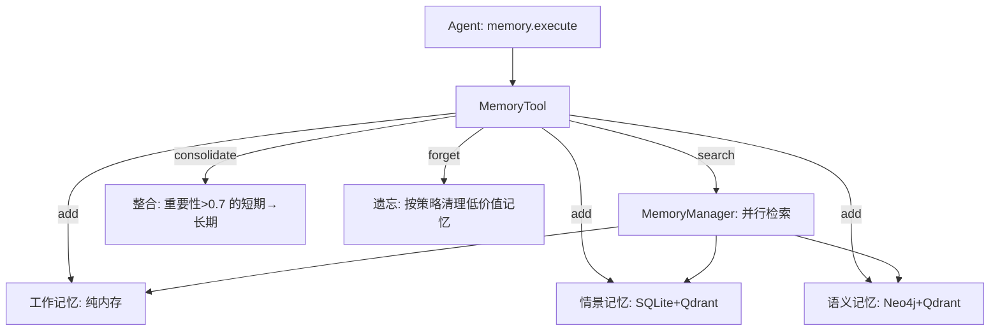

# MemoryTool（记忆工具）

## 组件职责

为 Agent 提供完整的记忆生命周期管理能力——添加、检索、摘要、遗忘、整合。封装为 Tool，通过 `action` 参数路由到不同操作。

## 为什么需要它？

Agent 需要记忆但不需要知道底层怎么存。MemoryTool 把四种记忆类型的复杂性隐藏在一个统一接口后面：Agent 只需要 `execute("add", ...)` 或 `execute("search", ...)`。

## 支持的操作

| action | 功能 | 关键参数 |
|--------|------|---------|
| `add` | 添加记忆 | `content`, `memory_type`, `importance` |
| `search` | 搜索记忆 | `query`, `limit`, `memory_types`, `min_importance` |
| `summary` | 记忆摘要 | — |
| `stats` | 统计信息 | — |
| `forget` | 遗忘 | `strategy`（importance/time/capacity） |
| `consolidate` | 短期→长期整合 | `from_type`, `to_type`, `importance_threshold` |
| `update` | 更新记忆 | — |
| `remove` | 删除记忆 | — |

## 架构

## 遗忘策略

| 策略 | 规则 | 使用场景 |
|------|------|---------|
| `importance_based` | 删除 `importance < threshold` 的记忆 | 日常清理 |
| `time_based` | 删除超过 `max_age_days` 的记忆 | 定期维护 |
| `capacity_based` | 接近上限时删除最不重要的 | 防止存储膨胀 |

## 我的理解

MemoryTool 是"约定优于配置"的典型：默认启用三种记忆（working/episodic/semantic），用户不需要理解内部存储细节。`importance` 参数是整个系统的核心杠杆——它不仅影响检索排序，还决定记忆在遗忘时的存亡和整合时的优先级。

## 相关章节

- [[Ch08_记忆与检索]]
