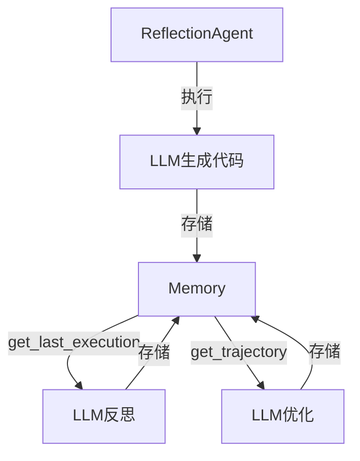

# Memory（Reflection 短期记忆模块）

## 组件职责

存储 Reflection Agent 的"执行-反思"迭代轨迹，为每一轮优化提供历史上下文。

## 为什么需要它？

Reflection 是多轮迭代的过程。LLM 本身是无状态的——如果不记录之前的尝试和反馈，它每轮都会"失忆"。Memory 模块让 Agent 拥有**短期记忆**，能回顾历史、积累经验，在迭代中逐步进步。

## 输入

- `add_record(record_type, content)` — 添加一条记录
  - `record_type`: `"execution"`（代码）或 `"reflection"`（评审反馈）
  - `content`: 记录的具体内容

## 处理过程

- `get_trajectory()` — 将所有记录序列化为格式化文本，供 Prompt 使用
- `get_last_execution()` — 获取最新一次执行结果（供反思使用）

## 输出

- 轨迹文本：格式化的多轮记录，插入到反思/优化提示词中
- 最新代码：最近一次生成的代码

## 与其他组件的关系



## 关键代码位置

- 文件：`00_Source/hello-agents/code/chapter4/Reflection.py`
- 类：`Memory`
- 方法：`add_record()`, `get_trajectory()`, `get_last_execution()`

## 数据结构

```python
Memory.records = [
    {"type": "execution",  "content": "def find_primes(n): ..."},   # 初版代码
    {"type": "reflection", "content": "时间复杂度O(n√n)太低..."},   # 评审反馈
    {"type": "execution",  "content": "def find_primes(n): # 筛法"}, # 优化版代码
    {"type": "reflection", "content": "筛法已最优，无需改进"},      # 最终评审
]
```

## 我的理解

Memory 模块看似简单（就是一个列表），但它解决了 LLM Agent 的一个核心问题：**无状态模型如何有记忆？**

答案是：把历史"序列化"成文本，塞进 Prompt 里。LLM 每次都"看到"完整的上下文，从而能基于历史做出更好的决策。这为后续学习 Ch08 的 Memory 和 RAG 做了很好的铺垫。

## 相关章节

- [[Ch04_智能体经典范式构建]]
- [[Ch08_记忆与检索]]（Memory 的进阶主题）
