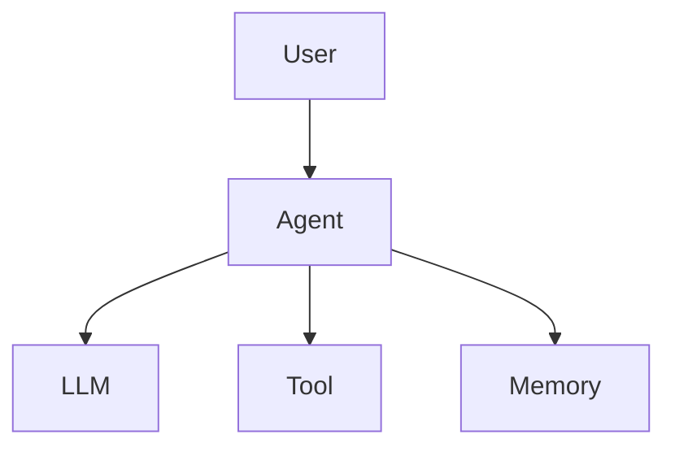

# 架构 / 组件名

## 组件职责

## 为什么需要它？

## 输入

-

## 处理过程

-

## 输出

-

## 与其他组件的关系

```mermaid
flowchart TD
    User[User] --> Agent[Agent]
    Agent --> LLM[LLM]
    Agent --> Tool[Tool]
    Agent --> Memory[Memory]
```

## 关键代码位置

- 文件：
- 类 / 函数：

## 我的理解

## 相关章节

- [[ChXX_章节标题]]
