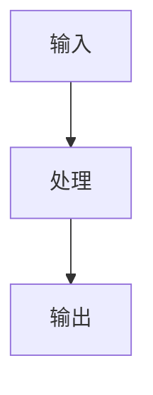

# ChXX 章节标题

## 1. 本章解决什么问题？

用 3 句话说明这一章要解决的问题。

## 2. 本章核心结论

-
-
-

## 3. 核心概念

- [[概念1]]：
- [[概念2]]：
- [[概念3]]：

## 4. 核心流程

## 5. 关键代码 / 工具 / 框架

- 相关文件：
- 相关类或函数：
- 需要跑通的例子：

## 6. 我学会了什么能力？

学完这一章后，我应该能够：

-
-
-

## 7. 我的理解

用自己的话解释这一章。

## 8. 还没懂的问题

- [ ]
- [ ]

## 9. 相关笔记

- 概念：
- 范式：
- 架构：
- 实验：
