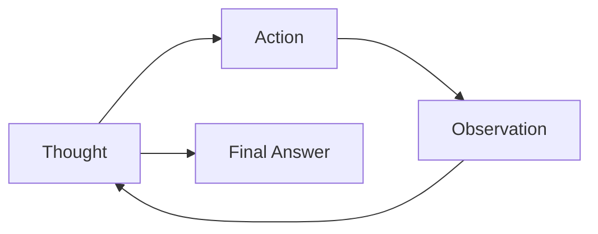

# 范式名

## 它解决什么问题？

## 基本循环


```mermaid
flowchart LR
    A[Thought] --> B[Action]
    B --> C[Observation]
    C --> A
    A --> D[Final Answer]
```

## 适合场景

-
-

## 不适合场景

-
-

## 关键 Prompt / 伪代码

```text

```

## 最小例子

## 我自己的理解

## 相关实验

- [[ChXX_实验主题]]

## 相关概念

- [[Agent]]
- [[Tool Calling]]
