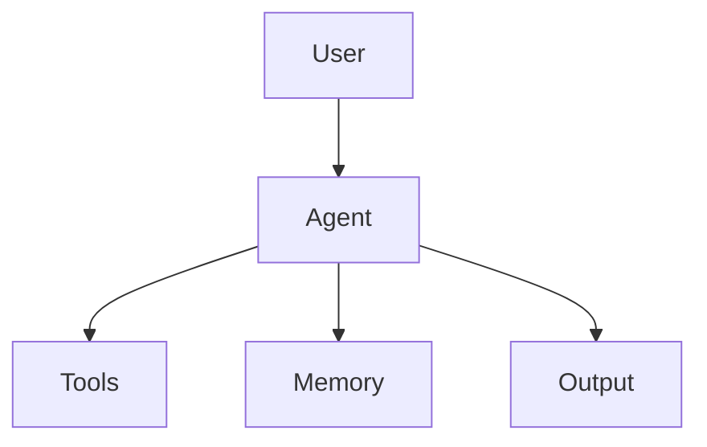

# 项目名

## 1. 项目目标

这个 Agent 要完成什么任务？

## 2. 用户输入

## 3. Agent 输出

## 4. 核心能力

- Planning：
- Tool Calling：
- Memory：
- RAG：
- Multi-Agent：
- Evaluation：

## 5. 最小可运行版本

```text
输入 -> 处理 -> 输出
```

## 6. 架构图



## 7. 迭代记录

### v0.1

- 实现：
- 问题：
- 下一步：

## 8. 评估方式

- 成功标准：
- 失败案例：
- 改进方向：
